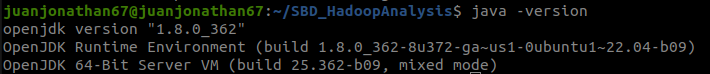
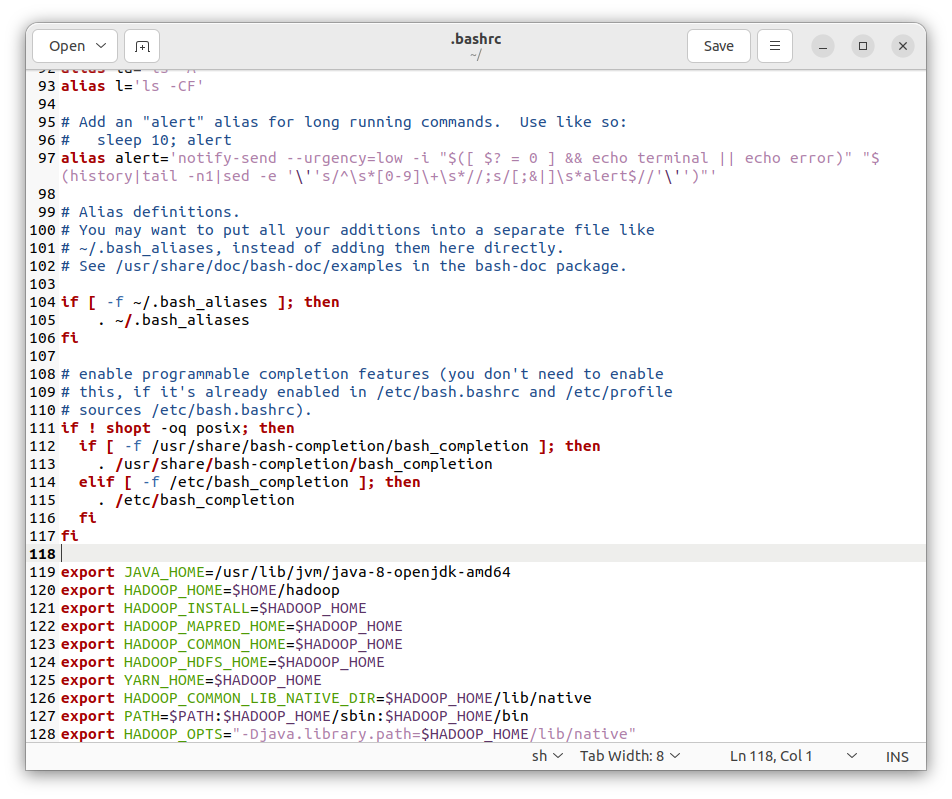
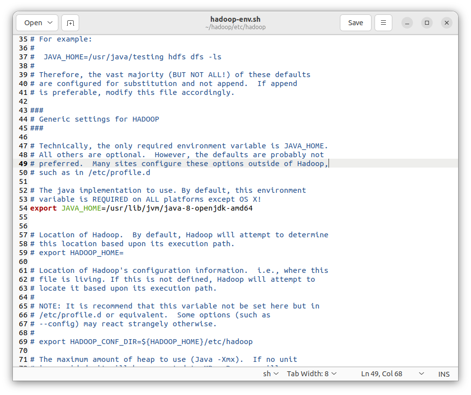
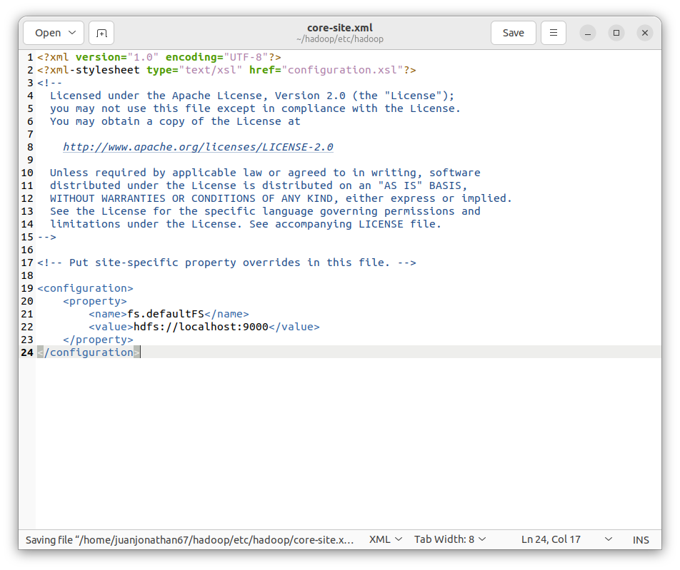
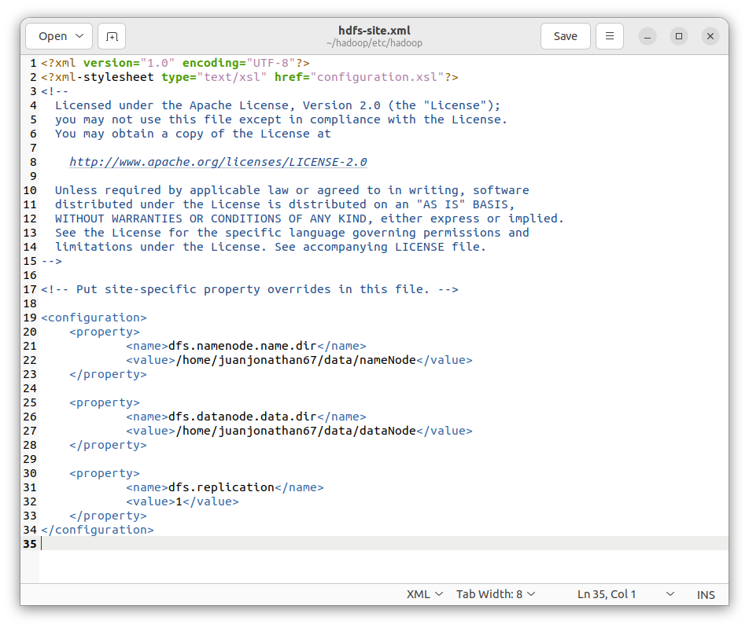
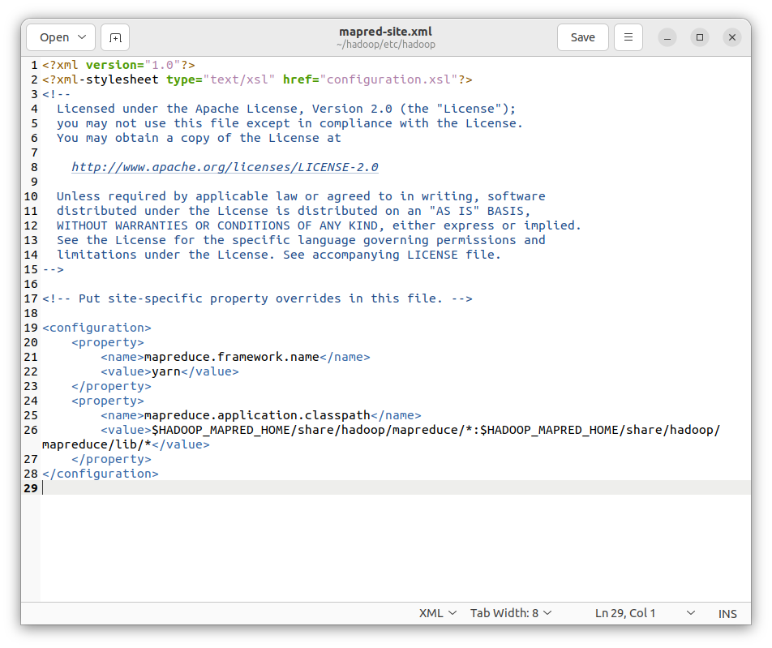
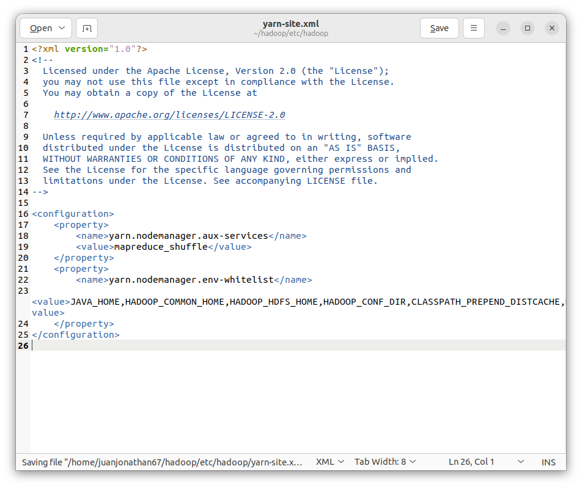
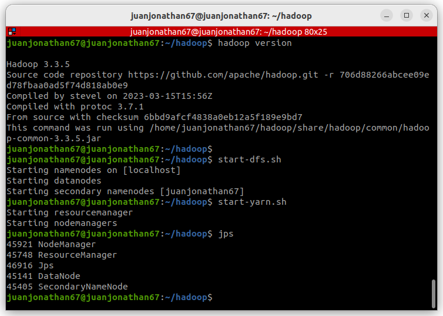
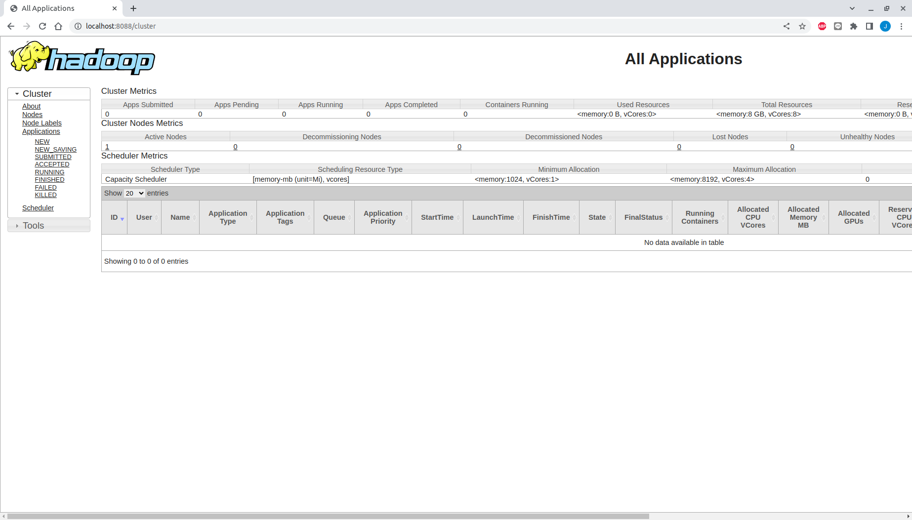
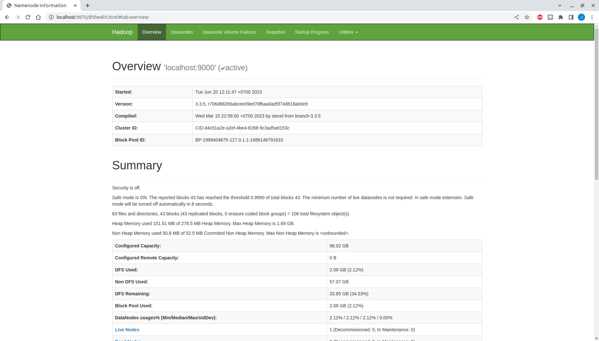

# SBD_HadoopAnalysis
Project untuk menganalisis waktu runtime efektif pada algoritma wordcount menggunakan hadoop dan python. Project ini digunakan untuk 

## Linux Installation

- Update system
```
sudo apt upgrade
```

- Install Java 8
```
sudo apt install openjdk-8-jdk
```

- Check java installation and version
```
java -version
```


- Install openssh
```
sudo apt install openssh-server openssh-client
```

- Generate ssh key
```
ssh-keygen -t rsa -P '' -f ~/.ssh/id_rsa
```

- Add ssh key to authorized key
```
cat ~/.ssh/id_rsa.pub >> ~/.ssh/authorized_keys
```

- Set permission 
```
chmod 0600 ~/.ssh/authorized_keys
```

- Check ssh connection
```
ssh localhost
```

- Install hadoop
```
cd ~
wget https://dlcdn.apache.org/hadoop/common/hadoop-3.3.5/hadoop-3.3.5.tar.gz
tar -xzvf hadoop-3.3.5.tar.gz
mv hadoop-3.3.5 hadoop
```

Hadoop excels when deployed in a fully distributed mode on a large cluster of networked servers. However, if you are new to Hadoop and want to explore basic commands or test applications, you can configure Hadoop on a single node.

This setup, also called pseudo-distributed mode, allows each Hadoop daemon to run as a single Java process. A Hadoop environment is configured by editing a set of configuration files:

- bashrc: Set environment variables used by Hadoop scripts
- hadoop-env.sh: Set environment variables used by Hadoop scripts
- core-site.xml: Set configuration parameters affecting Hadoop core, such as I/O settings that are common to HDFS and MapReduce
- hdfs-site.xml: Set configuration parameters specific to HDFS daemons, such as the location of data and name directories
- mapred-site.xml: Set configuration parameters specific to MapReduce daemons, such as the number of mapper and reducer slots to be used on each node
- yarn-site.xml: Set configuration parameters for the YARN daemons, such as the number of maximum applications to run simultaneously

- Edit bashrc
```
gedit ~/.bashrc
```

- Add the following lines to the end of the file
```
export JAVA_HOME=/usr/lib/jvm/java-8-openjdk-amd64
export HADOOP_HOME=$HOME/hadoop
export HADOOP_INSTALL=$HADOOP_HOME
export HADOOP_MAPRED_HOME=$HADOOP_HOME
export HADOOP_COMMON_HOME=$HADOOP_HOME
export HADOOP_HDFS_HOME=$HADOOP_HOME
export YARN_HOME=$HADOOP_HOME
export HADOOP_COMMON_LIB_NATIVE_DIR=$HADOOP_HOME/lib/native
export PATH=$PATH:$HADOOP_HOME/sbin:$HADOOP_HOME/bin
export HADOOP_OPTS="-Djava.library.path=$HADOOP_HOME/lib/native"
```



- Refresh bashrc
```
source ~/.bashrc
```

- Edit hadoop-env.sh
```
gedit $HOME/hadoop/etc/hadoop/hadoop-env.sh
```

- Add this line
```
export JAVA_HOME=/usr/lib/jvm/java-8-openjdk-amd64
```



- Edit core-site.xml
```
gedit $HOME/hadoop/etc/hadoop/core-site.xml
```

- Add the following lines
```
<configuration>
    <property>
        <name>fs.defaultFS</name>
        <value>hdfs://localhost:9000</value>
    </property>
</configuration>
```



- Edit hdfs-site.xml
```
gedit $HOME/hadoop/etc/hadoop/hdfs-site.xml
```

- Add the following lines
```
<configuration>
    <property>
            <name>dfs.namenode.name.dir</name>
            <value>/home/juanjonathan67/data/nameNode</value>
    </property>

    <property>
            <name>dfs.datanode.data.dir</name>
            <value>/home/juanjonathan67/data/dataNode</value>
    </property>

    <property>
            <name>dfs.replication</name>
            <value>1</value>
    </property>
</configuration>
```



- Edit mapred-site.xml
```
gedit $HOME/hadoop/etc/hadoop/mapred-site.xml
```

- Add the following lines
```
<configuration>
    <property>
        <name>mapreduce.framework.name</name>
        <value>yarn</value>
    </property>
    <property>
        <name>mapreduce.application.classpath</name>
        <value>$HADOOP_MAPRED_HOME/share/hadoop/mapreduce/*:$HADOOP_MAPRED_HOME/share/hadoop/mapreduce/lib/*</value>
    </property>
</configuration>
```



- Edit yarn-site.xml
```
gedit $HOME/hadoop/etc/hadoop/yarn-site.xml
```

- Add the following lines
```
<configuration>
    <property>
        <name>yarn.nodemanager.aux-services</name>
        <value>mapreduce_shuffle</value>
    </property>
    <property>
        <name>yarn.nodemanager.env-whitelist</name>
        <value>JAVA_HOME,HADOOP_COMMON_HOME,HADOOP_HDFS_HOME,HADOOP_CONF_DIR,CLASSPATH_PREPEND_DISTCACHE,HADOOP_YARN_HOME,HADOOP_HOME,PATH,LANG,TZ,HADOOP_MAPRED_HOME</value>
    </property>
</configuration>
```



- Check hadoop version
```
hadoop version
```

- Format namenode
```
hdfs namenode -format
```

- Start hadoop
```
start-dfs.sh
start-yarn.sh
```

- Check hadoop status
```
jps
```



- Check hadoop web interface
```
http://localhost:8088
```



- Check hdfs web interface
```
http://localhost:9870
```



